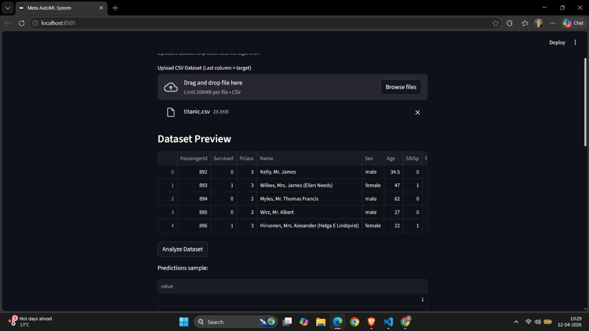

# 🌟 Meta-Learning Based AutoML System

A state-of-the-art automatic machine learning tool that leverages **meta-learning** to predict the best-performing classification algorithm for any custom tabular dataset. By analyzing the statistical and structural properties (meta-features) of an uploaded dataset, the system estimates the performance of various machine learning algorithms before training them, dramatically optimizing the model selection process.

---

## 🚀 Key Features

*   **Meta-Learning Core:** Recommends the optimal classification model by correlating new dataset properties with historical performance.
*   **Dynamic Streamlit Dashboard:** A user-friendly, responsive interface for uploading custom CSV datasets, previewing records, triggering statistical analysis, and viewing real-time comparisons.
*   **Comprehensive Meta-Feature Extraction:** Automated calculation of statistical features such as:
    *   *Dataset Dimensions:* Number of instances and features.
    *   *Target Balance:* Class entropy to assess target distribution variance.
    *   *Statistical Moments:* Mean feature variance.
    *   *Feature Interactions:* Mean absolute correlation coefficients.
*   **Robust Multi-Algorithm Support:** Incorporates a suite of six baseline models:
    *   Logistic Regression
    *   Decision Trees
    *   Random Forest Classifiers
    *   Gradient Boosting Classifiers
    *   Support Vector Classifiers (SVC)
    *   K-Nearest Neighbors (KNN)
*   **Hybrid Validation Model:** Performs real-time 5-fold cross-validation alongside weighted precision, recall, and F1-score evaluation to compare predicted vs. actual performance.

---

## 📐 System Architecture & Workflow

The architecture is divided into a **Meta-Training Phase** (where the system learns dataset-to-algorithm performance mappings) and an **Interactive Streamlit Inference Phase** (where users upload datasets and receive dynamic predictions).

```mermaid
flowchart TD
    subgraph Meta-Training Phase
        A[Reference Datasets: Iris, Breast Cancer] --> B[Extract Meta-Features]
        B --> C[Compute Statistical Properties]
        C --> D[Train & Evaluate Base Classifiers]
        D --> E[Create Meta-Dataset: meta_dataset.csv]
        E --> F[Train Meta RandomForestRegressor]
        F --> G[Save Artifacts: meta_model.pkl & meta_columns.pkl]
    end

    subgraph Streamlit Inference Phase
        H[User Uploads CSV Dataset] --> I[Data Cleaning & Preprocessing]
        I --> J[Extract Custom Meta-Features]
        G --> K[Meta RandomForestRegressor predicts accuracy for each algorithm]
        J --> K
        I --> L[Execute 5-Fold Cross-Validation on Base Classifiers]
        K --> M[Aggregate Predicted vs. Actual Metrics]
        L --> M
        M --> N[Render Interactive Streamlit Results Table & Highlight Winner]
    end

    style Meta-Training Phase fill:#f5f8ff,stroke:#4b8bf5,stroke-width:2px;
    style Streamlit Inference Phase fill:#fcf6ff,stroke:#c254ff,stroke-width:2px;

---

## 🖥️ System Demonstration

Here are screenshots showcasing the application interface, the meta-learning predictions, and the real-time model comparison tables:

<p align="center">
  
  
</p>
<p align="center">
  
  
</p>

---


## 📁 Repository Structure

```directory
├── venv/                       # Primary Python virtual environment
├── automl_env/                 # Secondary Python virtual environment
├── requirement.txt             # List of project dependencies
└── new/                        # Main project package directory
    ├── app.py                  # Streamlit dashboard & application runner
    ├── generate_meta_model.py  # Generates initial meta-dataset from reference datasets
    ├── train_meta_model.py     # Trains the RandomForestRegressor meta-model
    ├── artifacts/              # Directory containing serialized model binaries
    │   ├── meta_model.pkl      # Trained RandomForestRegressor model binary
    │   └── meta_columns.pkl    # Serialized feature list for hot-encoded validation
    └── meta/                   # Core modules
        ├── __init__.py         # Package initialization
        ├── base_models.py      # Predefined configurations of classification models
        └── meta_feature_extraction.py # Statistical meta-feature extraction calculations
```

---

## 🛠️ Installation & Setup

Follow these steps to configure your environment and run the application locally on macOS or any unix-based shell.

### 1. Configure the Virtual Environment
This repository comes with pre-configured environments (`venv` and `automl_env`). Activate your preferred environment:

```bash
# To activate the primary environment:
source venv/bin/activate

# OR to activate the secondary automl environment:
source automl_env/bin/activate
```

*(Optional)* If you want to recreate or update the environment from scratch, execute:
```bash
python3 -m venv venv
source venv/bin/activate
pip install -r requirement.txt
```

### 2. Verify / Regenerate the Meta-Model (Optional)
The pre-trained meta-model resides in `new/artifacts/`. If you want to rebuild the meta-model or extend the reference datasets, run:

```bash
# Generate a new meta_dataset.csv
python new/generate_meta_model.py

# Train the RandomForestRegressor meta-model and save artifacts
python new/train_meta_model.py
```

### 3. Launch the Streamlit Dashboard
Start the interactive application using the following command:

```bash
streamlit run new/app.py
```

Open the local address provided in the terminal (usually `http://localhost:8501`) to view the application in your browser.

---

## 💡 How it Works Under the Hood

### Meta-Feature Extraction
Before any model training begins, `meta_feature_extraction.py` calculates six mathematical attributes of your dataset:
*   **Mean Feature Variance ($\sigma^2$):** Measures the dispersion of continuous values across features.
*   **Mean Absolute Correlation ($|\rho|$):** Measures multicollinearity between independent variables.
*   **Class Entropy ($H$):** Measures uncertainty or class imbalance in the target labels. Calculated as:
    $$H(y) = -\sum_{i} P(y_i) \log_e P(y_i)$$

### Meta-Regression
Rather than predicting an arbitrary text label, the meta-model is trained as a **RandomForestRegressor** with $300$ estimators. It predicts the *exact accuracy percentage* that a specific algorithm is expected to yield given the structural shape of your dataset.

### Automated Data Pipeline
Upon uploading a CSV, `app.py` runs a robust data cleaning pipeline:
1. Catches categorical columns and converts them using one-hot encoding (`pd.get_dummies`).
2. Drops arbitrary key/index fields (like `id`).
3. Standardizes independent variables using `StandardScaler`.
4. Factorizes the target class `y` to handle numeric and string category representations correctly.

---

## 📋 Dependencies

The core framework relies on the following lightweight and highly compatible library stack defined in `requirement.txt`:
*   `streamlit` - Frontend interactive web application framework.
*   `pandas` - High-performance data manipulation and analysis library.
*   `numpy` - Multidimensional array computing.
*   `scikit-learn` - Machine learning model definitions, preprocessing tools, and evaluation metrics.
*   `joblib` - Lightweight pipelining and serialization.

> [!NOTE]  
> Make sure your CSV file has its target column in the **very last column** of the file, as the AutoML system uses this convention to split independent ($X$) and dependent ($y$) variables.

> [!TIP]
> To expand the capabilities of this system, you can add custom algorithms to the dictionary in `new/meta/base_models.py` and run the generation scripts to update the meta-learner automatically.
